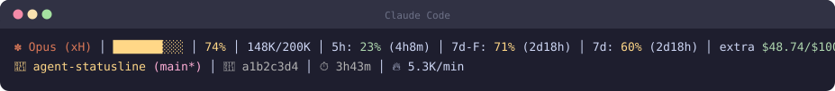
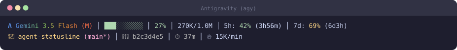

# agent-statusline


[English](README.md) | **한국어**


**Claude Code**



**Antigravity**



Claude Code와 Antigravity(`agy`)를 지원하는 상태줄  
 — 모델·컨텍스트·쿼터·비용을 보여주는 모듈형 위젯 시스템. 하나의 코드베이스가 호스트를 자동 감지해 각 호스트에 맞게 렌더링합니다.

## 지원 호스트

| 호스트 | 마크 | 사용량 | 비용 |
|---|---|---|---|
| **Claude Code** | `✽` | `rateLimit` `5h`  /  `7d-F` (Fable)  /  `7d`  /  `extra` (API credit) | `usage/credit` |
| **Antigravity** (`agy`) | `Λ` | `agentQuota` `5h` / `7d` | `agentCredits` (잔액 부족 경고) |

두 설치는 완전히 독립적입니다(서로의 파일·설정을 읽지 않음).
- Codex는 아직 커스텀 상태줄 훅이 없어 지원 대상이 아닙니다.


**비용 영역 자동 감지:** 로그인 정보로 계정 유형을 감지합니다(별도 설정 불필요). 
- 구독(Pro/Max/Team)은 `usage limit` 위젯을, 토큰당 과금 API 키 계정은 `cost`·`forecast`·`todayCost`를 표시합니다.

## 설치

**요구 사항:** Claude Code v1.0.80+ 또는 Antigravity `agy` · Node.js 18+

**Claude Code** (플러그인 마켓플레이스)

```
/plugin marketplace add smbslt3/agent-statusline
/plugin install agent-statusline
/agent-statusline:setup
```

**Antigravity (`agy`)** — 클론 후 원클릭 설치 스크립트를 실행합니다(번들을 agy 홈에 복사하고 `settings.json` 상태줄을 연결. agy는 명령을 공백으로 분리하므로 공백 없는 경로를 사용):

```powershell
git clone https://github.com/smbslt3/agent-statusline.git
cd agent-statusline
powershell -ExecutionPolicy Bypass -File .\install-agy.ps1   # macOS/Linux: sh ./install-agy.sh
```

이후 `agy`를 재시작하세요. (`dist/`가 커밋되어 있어 빌드는 선택 사항입니다.)

## 디스플레이 모드

`displayMode` 설정 또는 `/agent-statusline:setup <mode>`로 지정합니다:

```
# compact (1줄)
✽ Opus (xH) │ ░░░░ 0% │ 5h: 23% (4h27m) │ 7d-F: 71% (2d18h) │ 7d: 60% (2d18h) │ extra $48.74/$100.00

# normal (2줄, 기본값) — 프로젝트·세션·소모율·할 일 추가
✽ Opus (xH) │ ░░░░ 0% │ 5h: 23% (4h27m) │ 7d-F: 71% (2d18h) │ 7d: 60% (2d18h) │ extra $48.74/$100.00
📁 agent-statusline (main*) │ 🔑 33640295 │ ⏱ 3h43m │ 🔥 12K/min

# detailed (5줄) — 도구/에이전트 활동·캐시 적중률·토큰 분해 등 추가
```

## 설정

호스트별 설정 파일(설치는 독립적): Claude는 `~/.claude/agent-statusline.local.json`, agy는 `~/.gemini/antigravity-cli/agent-statusline.local.json`. 두 호스트 동일 스키마:

```json
{ "displayMode": "normal", "theme": "default", "separator": "pipe", "rateLimitResetDisplay": "remaining" }
```

| 키 | 값 |
|---|---|
| `displayMode` | `compact` / `normal`(기본) / `detailed` / `custom` |
| `theme` | `default` · `minimal` · `catppuccin` · `catppuccinLatte` · `dracula` · `gruvbox` · `nord` · `tokyoNight` · `solarized` |
| `separator` | `pipe`(기본) / `space` / `dot` / `arrow` |
| `rateLimitResetDisplay` | `remaining`(기본) / `resetTime` / `both` |
| `disabledWidgets` | 숨길 위젯 ID 배열 |
| `dailyBudget` | 숫자(USD) — `budget` 위젯 활성화(옵트인) |


## 위젯

40여 개 위젯을 카테고리로 제공합니다 — **코어**(`model`·`context`·`cost`·`projectInfo`), **한도/쿼터**(`rateLimit*`·`agentQuota*`), **세션**(`sessionId`·`sessionDuration`·`configCounts`), **활동**(`toolActivity`·`todoProgress`·`agentStatus`), **분석**(`burnRate`·`cacheHit`·`tokenBreakdown`·`forecast`). 호스트별 위젯은 자동 선택됩니다(Claude=속도 제한/비용, agy=쿼터/활동).

전체 위젯 목록과 프리셋 단축키는 [`commands/setup.md`](commands/setup.md)를 참고하세요.

## 명령어 (Claude Code)

- claude
  - `/agent-statusline:setup` — 표시 모드·테마·리셋 표시 설정
  - `/agent-statusline:update` — `/plugin update` 이후 런처 새로 고침


- Antigravity는 슬래시 명령이 없습니다 — 설정 파일을 편집해 재구성합니다.

## 문제 해결

- **안 보임** 
  - **claude**: `/plugin list` 확인 → `~/.claude/settings.json`에 `statusLine`이 있는지 확인 → 재시작
  - **agy**: `install-agy` 재실행, `command` 경로에 공백이 없고 `node`가 PATH에 있는지 확인 → 재시작

- **⚠️ 표시 (Claude):** OAuth 토큰 만료(재로그인) 또는 일시적 API 제한(실패는 약 30초 캐시)
- **캐시:** `~/.cache/agent-statusline/` 폴더 삭제로 초기화


## 라이선스

**MIT** ([LICENSE](LICENSE)). [uppinote20/claude-dashboard](https://github.com/uppinote20/claude-dashboard)(MIT)의 포크 — 두 호스트 지원, 프로바이더별 마크/색상, 실시간 agy 쿼터, 구독 플랜 자동 감지, Windows 지원을 추가했으며 원본 저작권 고지를 유지합니다.
